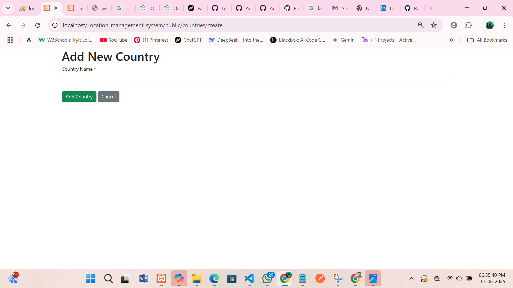
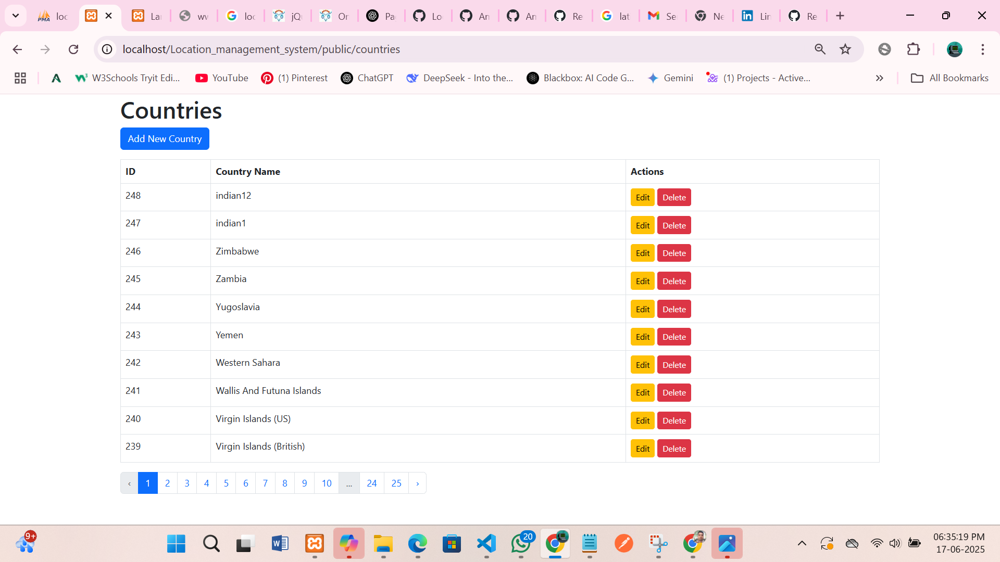
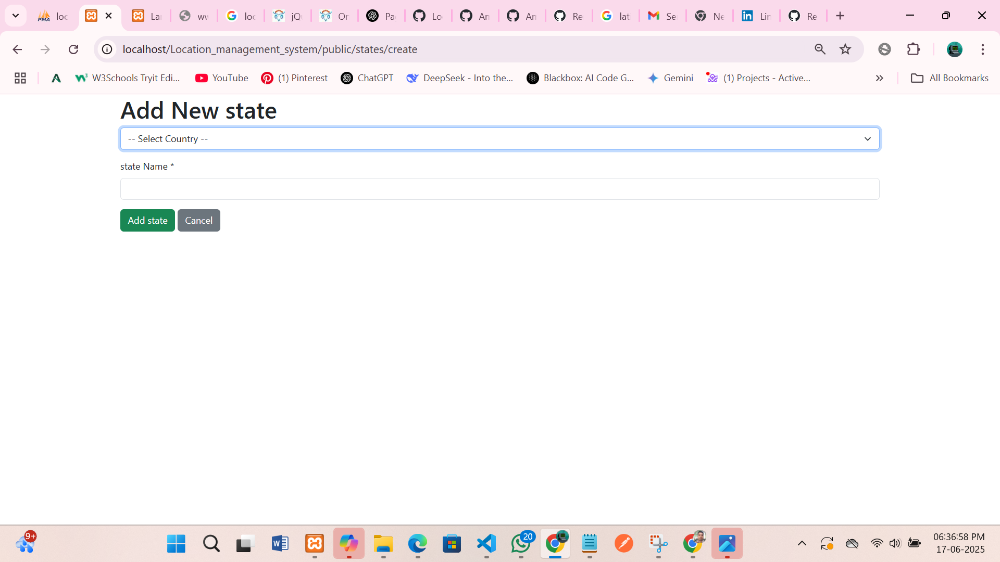
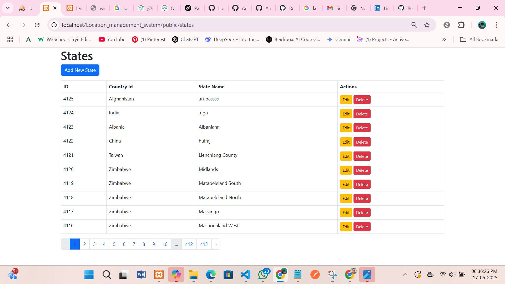
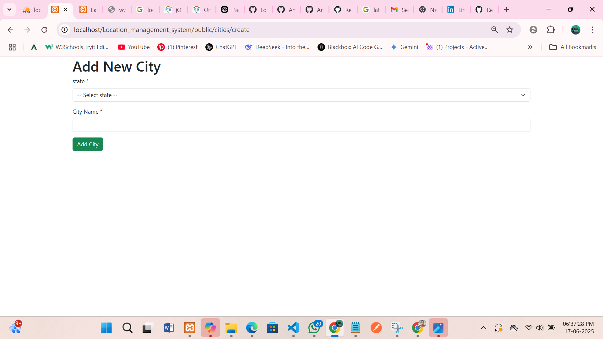
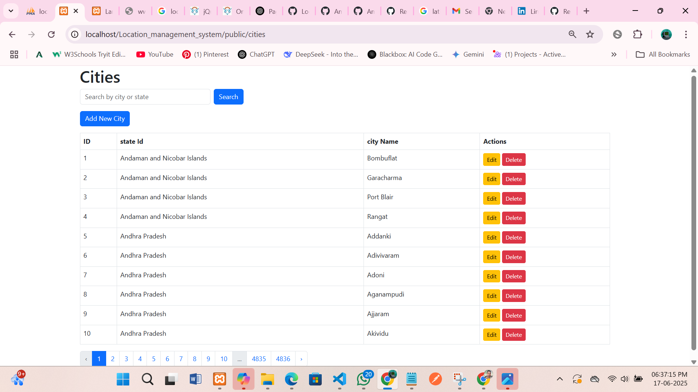

```markdown
# 🌍 Laravel Location Management System

This project offers a robust solution to **bulk import Countries, States, and Cities** into your Laravel application. It leverages a custom Artisan command to process location data from JSON files, ensuring efficient and duplicate-free population of your database.

---

## 📦 Features

* ✅ **Bulk Import:** Seamlessly import large datasets of countries, states, and cities.
* ✅ **Duplicate Prevention:** Utilizes `updateOrCreate()` to avoid redundant entries, maintaining data integrity.
* ✅ **Custom Artisan Command:** Easily trigger imports with `php artisan import:locations`.
* ✅ **Defined Relationships:** Establishes clear relationships between Country → State → City models.
* ✅ **JSON-Driven:** Data is imported directly from organized JSON files.
* ✅ **Laravel 12 Support:** Built with compatibility for the latest Laravel version.

---

## 📷 Screenshots

### Country Management




### State Management



### City Management



---

## ⚙️ Setup Instructions

Follow these steps to get your Laravel Location Management System up and running.

### 1️⃣ Project Structure

Ensure your project has the following directory and file structure:

```
app/
├── Console/
│   └── Commands/
│       └── ImportLocationData.php
database/
├── migrations/
│   └── 202x_xx_xx_create_countries_table.php
│   └── 202x_xx_xx_create_states_table.php
│   └── 202x_xx_xx_create_cities_table.php
app/
├── Models/
│   └── Country.php
│   └── State.php
│   └── City.php
storage/
└── app/
    ├── countries.json
    ├── states.json
    └── cities.json
```

### 2️⃣ Migrations

Create the necessary database tables by running your migrations.

#### `countries` table

```php
Schema::create('countries', function (Blueprint $table) {
    $table->id();
    $table->string('country_name');
    $table->string('sortname')->nullable();
    $table->string('phoneCode')->nullable();
    $table->timestamps();
});
```

#### `states` table

```php
Schema::create('states', function (Blueprint $table) {
    $table->id();
    $table->string('state_name');
    $table->foreignId('country_id')->constrained()->onDelete('cascade');
    $table->timestamps();
});
```

#### `cities` table

```php
Schema::create('cities', function (Blueprint $table) {
    $table->id();
    $table->string('city_name');
    $table->foreignId('state_id')->constrained()->onDelete('cascade');
    $table->timestamps();
});
```

### 3️⃣ Models & Relationships

Define your Eloquent models and their relationships as follows:

#### `Country.php`

```php
namespace App\Models;

use Illuminate\Database\Eloquent\Model;

class Country extends Model
{
    protected $fillable = ['country_name', 'sortname', 'phoneCode'];

    public function states()
    {
        return $this->hasMany(State::class);
    }
}
```

#### `State.php`

```php
namespace App\Models;

use Illuminate\Database\Eloquent\Model;

class State extends Model
{
    protected $fillable = ['state_name', 'country_id'];

    public function country()
    {
        return $this->belongsTo(Country::class);
    }

    public function cities()
    {
        return $this->hasMany(City::class);
    }
}
```

#### `City.php`

```php
namespace App\Models;

use Illuminate\Database\Eloquent\Model;

class City extends Model
{
    protected $fillable = ['city_name', 'state_id'];

    public function state()
    {
        return $this->belongsTo(State::class);
    }
}
```

### 4️⃣ JSON File Format

Ensure your JSON data files (`countries.json`, `states.json`, `cities.json`) are located in the `storage/app/` directory and follow these structures:

#### `storage/app/countries.json`

```json
{
  "countries": [
    {
      "id": 1,
      "country_name": "India",
      "sortname": "IN",
      "phoneCode": "91"
    }
  ]
}
```

#### `storage/app/states.json`

```json
{
  "states": [
    {
      "id": 1,
      "state_name": "Uttar Pradesh",
      "country_id": 1
    }
  ]
}
```

#### `storage/app/cities.json`

```json
{
  "cities": [
    {
      "id": 1,
      "city_name": "Lucknow",
      "state_id": 1
    }
  ]
}
```

### 5️⃣ Artisan Command

#### Generate Command

Run the following command to generate the `ImportLocationData` Artisan command:

```bash
php artisan make:command ImportLocationData
```

#### Register Signature

In your `app/Console/Commands/ImportLocationData.php` file, register the command signature:

```php
protected $signature = 'import:locations';
```

#### `handle()` method

Implement the `handle()` method in `app/Console/Commands/ImportLocationData.php` to process the JSON files:

```php
public function handle()
{
    $this->info('Starting data import...');

    // Import Countries
    $countriesPath = storage_path('app/countries.json');
    if (File::exists($countriesPath)) {
        $data = json_decode(File::get($countriesPath), true);
        foreach ($data['countries'] ?? [] as $country) {
            if (!isset($country['id'])) continue;
            Country::updateOrCreate(
                ['id' => $country['id']],
                ['country_name' => $country['country_name'], 'sortname' => $country['sortname'] ?? null, 'phoneCode' => $country['phoneCode'] ?? null]
            );
        }
        $this->info('Countries imported.');
    }

    // Import States
    $statesPath = storage_path('app/states.json');
    if (File::exists($statesPath)) {
        $data = json_decode(File::get($statesPath), true);
        foreach ($data['states'] ?? [] as $state) {
            if (!isset($state['id'])) continue;
            State::updateOrCreate(
                ['id' => $state['id']],
                ['state_name' => $state['state_name'], 'country_id' => $state['country_id']]
            );
        }
        $this->info('States imported.');
    }

    // Import Cities
    $citiesPath = storage_path('app/cities.json');
    if (File::exists($citiesPath)) {
        $data = json_decode(File::get($citiesPath), true);
        foreach ($data['cities'] ?? [] as $city) {
            if (!isset($city['id'])) continue;
            City::updateOrCreate(
                ['id' => $city['id']],
                ['city_name' => $city['city_name'], 'state_id' => $city['state_id']]
            );
        }
        $this->info('Cities imported.');
    }

    $this->info('✅ All data imported successfully!');
}
```

---

## 🚀 Run Import Command

Once everything is set up, execute the following Artisan command to import data from your JSON files into the database:

```bash
php artisan import:locations
```

---

## 📎 License

This project is open-source and free to use.

---

## 🙋 Author

Amir Saifi
```